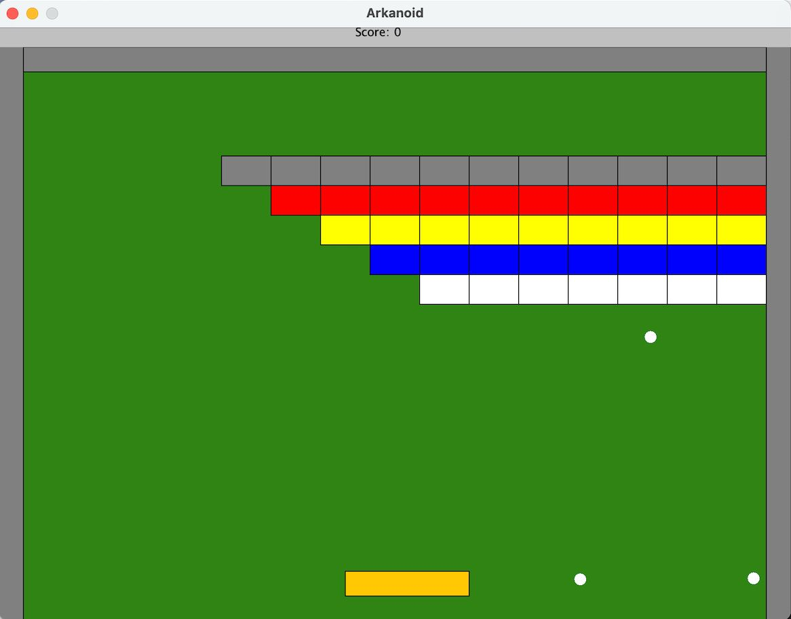

# 🧱 Arkanoid (Java OOP Project)

A classic arcade-style brick breaker game built using **Java**.

<p align="center">
  
</p>


## 📖 About The Project

This project is a recreation of the legendary "Arkanoid" (or Breakout) game. It was designed to demonstrate proficiency in **Object-Oriented Programming (OOP)** principles and Java game development fundamentals.

The game features a player-controlled paddle, a bouncing ball, and a wall of destructible bricks. The goal is to clear all the bricks without letting the ball fall below the paddle.

---

## ✨ Key Features

* **Classic Gameplay Loop:** Real-time rendering and game physics.
* **Collision Detection:** Accurate hitboxes for the ball, paddle, borders, and bricks.
* **Score & Life Tracking:** Dynamic HUD updates as gameplay progresses.
* **Game States:** Handling of Start Screen, Gameplay, Pause, and Game Over conditions.

---

## ⚙️ Architecture & OOP Design

This project relies heavily on object-oriented architecture to keep the code modular, readable, and scalable.

### 1. Class Hierarchy & Inheritance
The game entities share common traits (position, velocity, dimensions).
* **`Sprite` / `GameObject` (Abstract Class):** Defines the core properties for all moving objects on the screen.
* **`Ball`, `Paddle`, `Block`:** These concrete classes extend the base class, inheriting movement logic while implementing their own unique behaviors (e.g., the Paddle listens to input, while Blocks remain static until hit).

### 2. Interfaces & Polymorphism
* **`Collidable` Interface:** Allows the Game Engine to treat different objects (Walls, Blocks, Paddle) uniformly when checking for physics interactions.
* **`HitListener`:** Uses the Observer Pattern to notify game objects when a specific event occurs (e.g., when a block is destroyed, it notifies the ScoreCounter).

### 3. Encapsulation
* Game logic is strictly separated from the input handling and rendering code.
* Private fields preserve the internal state of objects (like ball velocity or current score), exposed only via controlled getters/setters or specific methods.

### 4. The Game Loop
* Implements a `Runnable` thread or a `Timer` to handle the animation frame rate, ensuring smooth movement independent of system speed.

---

## 🚀 How to Run?

Just Clone and run:  
```bash
chmod +x ./compile.sh
./compile.sh -r Ass5Game
```

---

## 🎮 Controls

* **Left Arrow** Move Paddle Left
* **Right Arrow:** Move Paddle Right
  

**Blocks will only break if the block and the ball are different colors**
